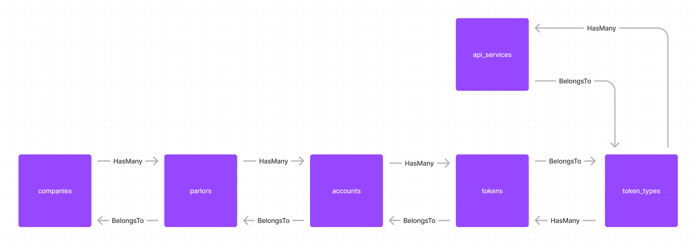

# wp-database

# 1 Этап
## База данных:
- DB_CONNECTION=mysql
- DB_HOST=141.8.192.46
- DB_PORT=3306
- DB_DATABASE=a0858077_wb_api_database
- DB_USERNAME=a0858077_wb_api_database
- DB_PASSWORD=pqtd1awm25

## Таблицы:
- incomes
- orders
- sales
- stocks
  
## Команды запуска парсинга:
- **command**: php artisan pars:incomes
- **command**: php artisan pars:orders
- **command**: php artisan pars:sales
- **command**: php artisan pars:stocks

## Маршруты:
main:
- http://a0858077.xsph.ru/main
 
income:
- http://a0858077.xsph.ru/income
- http://a0858077.xsph.ru/income/show/1/1

order:
- http://a0858077.xsph.ru/order
- http://a0858077.xsph.ru/order/show/1/1

sale:
- http://a0858077.xsph.ru/sale
- http://a0858077.xsph.ru/sale/show/1/1

stock:
- http://a0858077.xsph.ru/stock
- http://a0858077.xsph.ru/stock/show/1/1

# 2 Этап
## Schema

## Обновления:
- добавление docker-compose и Dockerfile.
- модели, миграции, связи: Company, Office, Account, Token, TokenType, ApiService.
- cron задача с частотой 12 часов.
- тесты ApiServiceTest, CreateModelTest.
- ParsingServiceAbstract: ParsingServiceCircle - запуск в цикле, ParsingServiceQueues - запуск через очереди.
- команды для создания: Company, ApiService, Office, TokenType, Token.
